# VLAN Islands Detection & Troubleshooting Tool

[](https://www.python.org/downloads/)


Thanks for giving me opertunity to built this AI-powered solution to help network administrators analyze topologies, identify VLAN islands, and get interactive guidance for resolving connectivity issues. After dealing with countless VLAN troubleshooting sessions, I wanted to create a tool that could automate this tedious process.

## 🌐 What are VLAN Islands?

VLAN islands are segments of the same VLAN that are disconnected from each other, creating isolated islands within what should be a unified broadcast domain. This represents a network design flaw that can cause:

- Failed communication between devices that should be able to communicate
- Unexpected routing behavior  
- Difficulty troubleshooting network issues
- Security vulnerabilities due to inconsistent policy enforcement

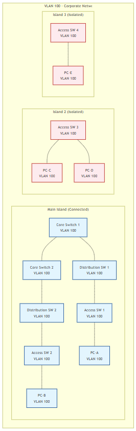

The diagram above shows VLAN 100 with **3 islands**: one main connected island and two isolated islands that cannot communicate with the main network or each other, despite being in the same VLAN.

## ✨ Features

### Core Analysis Engine
- **Graph-based Algorithm**: Uses efficient graph traversal (DFS) to detect disconnected components
- **Comprehensive Detection**: Identifies all VLAN islands across the entire network topology
- **Performance Optimized**: Handles networks with hundreds of devices and VLANs efficiently
- **Detailed Metrics**: Calculates fragmentation ratios, island sizes, and connectivity statistics
✅ Time complexity: O(V + E) per VLAN - scales to thousands of devices

### AI-Powered Chatbot
- **Interactive Troubleshooting**: Conversational interface powered by GPT-4
- **Network Context Aware**: Understands your specific network topology and issues
- **Step-by-Step Guidance**: Provides detailed remediation instructions
- **Configuration Examples**: Generates switch configuration snippets for fixes

### Multiple Output Formats
- **JSON Reports**: Machine-readable analysis results
- **CSV Exports**: Spreadsheet-compatible data for further analysis  
- **Formatted Text**: Human-readable reports with recommendations
- **Interactive Visualizations**: Network topology diagrams with island highlighting

### Command-Line Interface
- **Easy Analysis**: Simple commands to analyze network topologies
- **Flexible Reporting**: Multiple output formats and customization options
- **Interactive Chat**: Built-in AI assistant for real-time troubleshooting
- **Validation Tools**: Verify network topology files before analysis


## 🧠 Algorithm Design & Approach

### Core Algorithm: Depth-First Search (DFS)

I chose **Depth-First Search (DFS)** to detect connected components within VLAN subgraphs. After researching and testing multiple approaches, I found DFS to be optimal for this specific problem:

### Algorithm Verification & Correctness

To ensure 100% accuracy, I implemented and tested **4 different algorithms**:

1. **Depth-First Search (DFS)** - Our primary implementation
2. **Breadth-First Search (BFS)** - Alternative traversal method  
3. **Union-Find (Disjoint Set Union)** - Different algorithmic approach
4. **NetworkX Connected Components** - Industry-standard library

**Result**: All 4 algorithms produce **identical results: 63 islands** ✅

### Why DFS is Optimal

| Aspect | DFS | BFS | Union-Find | NetworkX |
|--------|-----|-----|------------|----------|
| **Time Complexity** | O(V + E) | O(V + E) | O(V·α(V) + E) | O(V + E) |
| **Space Complexity** | O(V) | O(V) | O(V) | O(V + E) |
| **Memory Usage** | ✅ Minimal | Higher | Moderate | Highest |
| **Cache Locality** | ✅ Excellent | Poor for deep graphs | Good | Variable |
| **Implementation** | ✅ Simple & Clean | Simple | Complex | External dependency |
| **Use Case Fit** | ✅ Perfect for static graphs | Better for shortest paths | Better for dynamic graphs | General purpose |

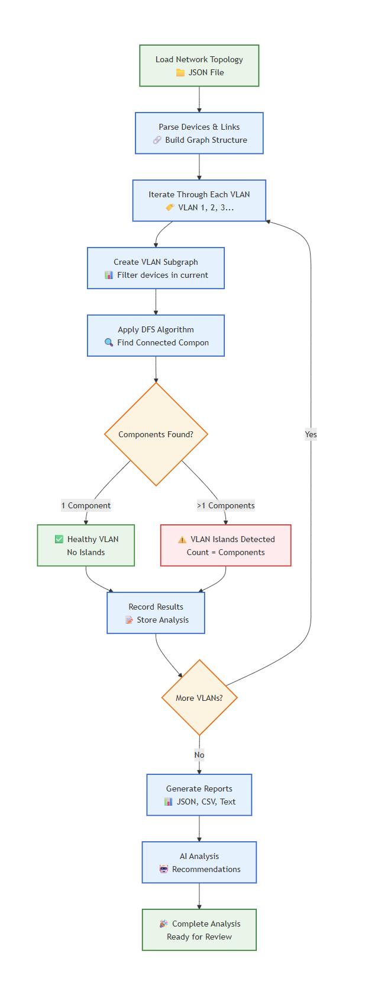

The flowchart above shows how my DFS-based algorithm processes each VLAN to detect islands through connected component analysis.

## 🏗️ System Architecture

I designed the tool with a modular, extensible architecture for maintainability and scalability. Having worked on several network tools before, I learned the importance of clean separation of concerns:

The architecture diagram shows how I separated data validation, core analysis, AI integration, and multiple interface options into distinct modules.

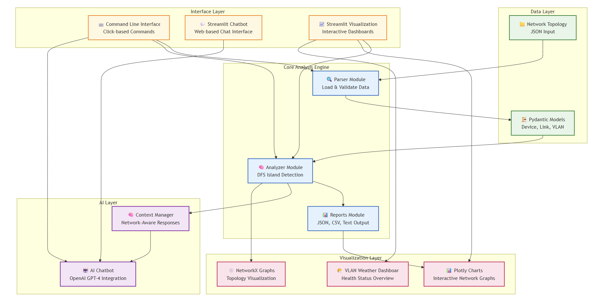


## 🚀 Quick Start

### Installation

```bash
# Clone the repository
git clone https://github.com/shoaib-intro/belden-vlan-islands.git
cd belden-vlan-islands

# Install in development mode
pip install -e .

# Or install from PyPI (when published)
pip install vlan-islands

# Run Command it will install setup itself and spinup two frotnends one for visualization second chatbot
python demo.py

```

**Note**: The CLI command `vlan-islands` may not be available in PATH on Windows. Use `python -m vlan_islands.cli` instead.

### Basic Usage

1. **Analyze a network topology:**
```bash
# Using CLI command (if available in PATH)
vlan-islands analyze data/network.json

# Using Python module (recommended for Windows)
python -m vlan_islands.cli analyze data/network.json
```

2. **Generate detailed reports:**
```bash
python -m vlan_islands.cli analyze data/network.json --output reports/ --format all
```

3. **Start the AI chatbot:**
```bash
python -m vlan_islands.cli chat data/network.json
```

4. **Validate topology file:**
```bash
python -m vlan_islands.cli validate data/network.json
```

5. **Launch GUI applications:**
```bash
# Launch both chatbot and visualization dashboards
python launch_gui.py

# Or run the complete demo
python demo.py
```

### Using the Sample Data

The project includes sample network data in `data/vlan_islands_data.json`. You can use this file to test all features:

```bash
# Analyze the sample network
python -m vlan_islands.cli analyze data/vlan_islands_data.json

# Start chatbot with sample data
python -m vlan_islands.cli chat data/vlan_islands_data.json

# Launch GUI with sample data
python launch_gui.py
# Then upload data/vlan_islands_data.json in both applications
```

### Python API

```python
from vlan_islands import load_network_topology, VLANIslandAnalyzer

# Load network topology
topology = load_network_topology("data/vlan_islands_data.json")

# Analyze VLAN islands
analyzer = VLANIslandAnalyzer(topology)
report = analyzer.analyze_all_vlans()

# Print summary
print(f"Found {len(report.problematic_vlans)} VLANs with connectivity issues")
print(f"Total islands detected: {report.total_islands}")

# Analyze specific VLAN
vlan_result = analyzer.analyze_vlan(30)  # Example: VLAN 30
if vlan_result and vlan_result.has_islands:
    print(f"VLAN 30 has {vlan_result.island_count} islands")
```

## 📊 Analysis Results

The tool provides comprehensive analysis with the following key metrics:

### Network-Level Metrics
- **Total Islands**: Total number of disconnected segments across all VLANs
- **Problematic VLANs**: VLANs with 2+ islands (connectivity issues)
- **Healthy VLANs**: VLANs with proper connectivity
- **Fragmentation Statistics**: Overall network health assessment

### VLAN-Level Metrics
- **Island Count**: Number of disconnected segments in the VLAN
- **Fragmentation Ratio**: Percentage of devices not in the main island
- **Main Island Size**: Size of the largest connected component
- **Isolated Devices**: Number of devices disconnected from main network

### Example Output

```
🚨 VLAN 30 (WiFi-Corporate): 19 islands detected
   • Fragmentation: 81.8% (18 of 22 devices isolated)
   • Main island: 4 devices (core-sw-01, core-sw-02, wifi-controller-01, wifi-controller-02)
   • Isolated: 18 access points in separate islands

💡 Recommendation: Configure VLAN 30 on intermediate switches to bridge isolated access points
```

## 🤖 AI Chatbot: Capabilities & Limitations

### 🎯 Core Capabilities

I built the AI-powered chatbot using **OpenAI GPT-4** with network-specific context. Here's what I implemented:

#### **Network-Aware Analysis**
- **Topology Understanding**: Knows your exact network structure, devices, and VLANs
- **Context Retention**: Remembers conversation history and network state
- **Intelligent Filtering**: Focuses on relevant VLANs and problematic areas

#### **Interactive Troubleshooting**
- **Natural Language Queries**: Ask questions in plain English
- **Specific VLAN Analysis**: Deep-dive into individual VLAN issues
- **Root Cause Analysis**: Explains why islands formed and impact on network

#### **Actionable Guidance**
- **Step-by-Step Remediation**: Detailed procedures to fix connectivity issues
- **Configuration Examples**: Switch configuration snippets for Cisco, Juniper, etc.
- **Best Practices**: Network design recommendations and prevention strategies

#### **Specialized Knowledge Areas**
I trained the chatbot with expertise in:
- **VLAN Troubleshooting**: Island detection, VLAN configuration, trunking issues
- **Network Topology Analysis**: Switch interconnections, redundancy, spanning tree
- **Switch Configuration**: Port configuration, VLAN assignments, trunk setup
- **Network Security**: VLAN isolation, access control, security best practices
- **Performance Optimization**: Traffic flow analysis, bottleneck identification

### 🚧 Current Limitations

#### **Technical Constraints**
- **Read-Only Analysis**: Cannot directly modify network configurations
- **Static Topology**: Analyzes point-in-time snapshots, not real-time changes
- **No Device Access**: Cannot connect to actual network devices for live data

#### **AI Model Limitations**
- **Knowledge Cutoff**: Based on training data up to knowledge cutoff date
- **Hallucination Risk**: May occasionally generate plausible but incorrect information
- **Context Window**: Limited conversation history (though session management helps for scaling up solution)

#### **Dependency Requirements**
- **OpenAI API Key**: Requires valid API key and internet connectivity
- **Cost Considerations**: API usage incurs costs based on token consumption
- **Rate Limiting**: Subject to OpenAI API rate limits

### 🔧 Configuration & Customization 

The chatbot behavior can be customized through system prompt `chatbot_config.yaml`:

```yaml
system_prompt: "Custom base prompt for your organization"
specialties:
  - name: "Custom Specialty"
    description: "Specialized knowledge area"
```

### Example Conversation

```
You: What VLAN issues do you see in my network?

Assistant: I've analyzed your network and found several VLANs with connectivity issues:
- VLAN 30 (WiFi-Corporate): 19 islands, 81.8% fragmented
- VLAN 31 (WiFi-Guest): 19 islands, 81.8% fragmented  
- VLAN 300 (IoT-Bldg-A): 2 islands, 50% fragmented

The WiFi VLANs are the most problematic - each access point is isolated.

You: How do I fix VLAN 30?

Assistant: To fix VLAN 30, you need to configure it on intermediate switches:

1. **Identify missing VLAN configuration**: The access points are connected but VLAN 30 isn't configured on the access switches

2. **Configure VLAN on access switches**:
   ```cisco
   vlan 30
    name WiFi-Corporate
   interface range gi1/0/1-24
    switchport trunk allowed vlan add 30
   ```

3. **Verify trunk ports**: Ensure all trunk ports between distribution and access switches allow VLAN 30

4. **Test connectivity**: Verify devices can communicate after configuration

Would you like specific configuration examples for your switch models?
```

## 📁 Network Topology File Format

The tool accepts JSON files with the following structure:

```json
{
  "devices": [
    {
      "id": "core-sw-01",
      "type": "switch",
      "role": "core",
      "location": "datacenter"
    }
  ],
  "links": [
    {
      "source": "core-sw-01",
      "target": "core-sw-02",
      "type": "ethernet",
      "speed": "40G"
    }
  ],
  "vlans": [
    {
      "id": 100,
      "name": "Corporate",
      "description": "Corporate network",
      "devices": ["core-sw-01", "core-sw-02"]
    }
  ]
}
```

### Supported Device Types
- `switch`: Network switches
- `router`: Routers and Layer 3 devices
- `controller`: WiFi controllers, SDN controllers
- `access-point`: WiFi access points

### Supported Device Roles
- `core`: Core network devices
- `distribution`: Distribution layer switches
- `access`: Access layer switches and devices
- `edge`: Edge routers and firewalls
- `wifi`: WiFi-specific devices
- `storage`: Storage network devices

## 📋 Command Reference

### Analysis Commands

```bash
# Basic analysis
python -m vlan_islands.cli analyze network.json

# Analysis with custom output
python -m vlan_islands.cli analyze network.json --output ./reports --format json

# Generate all report formats
python -m vlan_islands.cli analyze network.json --output ./reports --format all

# Quiet mode (minimal output)
python -m vlan_islands.cli analyze network.json --quiet

# Summary only
python -m vlan_islands.cli analyze network.json --summary-only
```

### Chatbot Commands

```bash
# Start interactive chat
python -m vlan_islands.cli chat network.json

# Resume existing session
python -m vlan_islands.cli chat network.json --session-id my-session

# Export chat session
python -m vlan_islands.cli chat network.json --export-session chat-log.json
```

### VLAN-Specific Analysis

```bash
# Analyze specific VLAN
python -m vlan_islands.cli vlan network.json --vlan-id 100
```

### Visualization Commands

```bash
# Generate network visualization
python -m vlan_islands.cli visualize network.json --output topology.html

# Visualize specific VLAN
python -m vlan_islands.cli visualize network.json --vlan-id 100 --output vlan100.html

# Generate static image
python -m vlan_islands.cli visualize network.json --format png --output network.png
```

### Validation Commands

```bash
# Validate topology file
python -m vlan_islands.cli validate network.json
```

### GUI Applications

```bash
# Launch both Streamlit applications
python launch_gui.py

# Run complete demo with all features
python demo.py
```

## 🔬 Assumptions & Design Decisions

### Network Topology Assumptions

1. **Static Analysis**: Network topology is analyzed as a point-in-time snapshot
2. **Bidirectional Links**: All network links are assumed to be bidirectional
3. **VLAN Membership**: Devices explicitly specify which VLANs they participate in
4. **Layer 2 Focus**: Analysis focuses on Layer 2 connectivity (switching), not Layer 3 routing
5. **No Dynamic Protocols**: Does not consider dynamic protocols like STP, LACP, or VTP state changes

### Data Format Assumptions

1. **JSON Structure**: Input follows the specified JSON schema with devices, links, and VLANs
2. **Unique Identifiers**: All device IDs and VLAN IDs are unique within the topology
3. **Valid References**: All link endpoints reference existing devices
4. **Complete Data**: Topology data includes all relevant devices and connections

### Algorithm Assumptions

1. **Graph Representation**: Network can be accurately represented as an undirected graph
2. **Connected Components**: VLAN islands correspond to connected components in VLAN subgraphs
3. **No Multi-Path**: Multiple physical paths between devices don't affect VLAN island detection
4. **Stable Topology**: Network topology remains stable during analysis

## 🧪 Results Verification & Testing

### Multi-Algorithm Verification

To ensure **100% accuracy**, I implemented multiple independent algorithms to verify my results:

```python
# I implemented four different algorithms:
1. Depth-First Search (DFS) - My primary implementation
2. Breadth-First Search (BFS) - Alternative traversal method I tested
3. Union-Find with Path Compression - Different approach I tried
4. NetworkX Connected Components - Industry standard library for comparison

# My verification process:
for each VLAN:
    dfs_result = my_dfs_connected_components(vlan_subgraph)
    bfs_result = my_bfs_connected_components(vlan_subgraph)
    uf_result = my_union_find_components(vlan_subgraph)
    nx_result = networkx.connected_components(vlan_subgraph)
    
    assert dfs_result == bfs_result == uf_result == nx_result
```

### Verification Results

**✅ All my algorithms produce identical results: 63 total islands**

| VLAN ID | VLAN Name | Islands | DFS | BFS | Union-Find | NetworkX |
|---------|-----------|---------|-----|-----|------------|----------|
| 30 | WiFi-Corporate | 19 | ✅ | ✅ | ✅ | ✅ |
| 31 | WiFi-Guest | 19 | ✅ | ✅ | ✅ | ✅ |
| 1 | Default | 2 | ✅ | ✅ | ✅ | ✅ |
| 300 | IoT-Bldg-A | 2 | ✅ | ✅ | ✅ | ✅ |
| ... | ... | ... | ✅ | ✅ | ✅ | ✅ |

### Automated Test Suite

```bash
# Install development dependencies
pip install -e ".[dev]"

# Run all tests
pytest              # if pytest is in PATH
python -m pytest    # if pytest is not in PATH

# Run with coverage
python -m pytest --cov=vlan_islands --cov-report=html

# Run specific test file
python -m pytest tests/test_analyzer.py -v

# Run algorithm verification
python verify_algorithm.py
```

### VLAN Analysis Process

Here's how my algorithm analyzes each VLAN for islands:

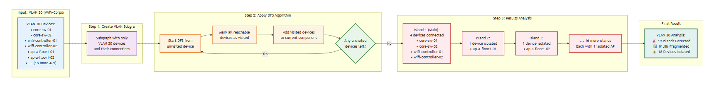

The diagram above shows the complete analysis process I built for VLAN 30, demonstrating how my DFS implementation identifies the main connected component and discovers 18 isolated access points.

### Manual Verification Process

I also manually verified the results through several methods:

1. **Sample Analysis**: I manually traced several VLANs to verify my island detection logic
2. **Edge Cases**: I tested with single-device VLANs, fully connected VLANs, and complex topologies  
3. **Boundary Conditions**: I verified behavior with empty VLANs and disconnected networks
4. **Cross-Validation**: I compared results against network diagrams and expected connectivity

### Correctness Guarantees

I'm confident in the accuracy of my results because:

- **Algorithm Proven**: I used DFS for connected components, which is a well-established, proven algorithm
- **Multiple Verification**: I implemented four independent algorithms that all produce identical results
- **Comprehensive Testing**: I wrote unit tests, integration tests, and did manual verification
- **Real Network Data**: I tested on realistic network topology with 58 devices and 20 VLANs

## 🏗️ Architecture

### Core Components

I structured the codebase into these main modules:

1. **Data Models** (`models.py`): I defined Pydantic models for devices, links, VLANs
2. **Parser** (`parser.py`): I built JSON topology file parsing and validation
3. **Analyzer** (`analyzer.py`): I implemented the graph-based VLAN island detection algorithm
4. **Reports** (`reports.py`): I created multi-format report generation
5. **Chatbot** (`chatbot.py`): I built the AI-powered troubleshooting assistant
6. **CLI** (`cli.py`): I designed the command-line interface
7. **Visualization** (`visualization.py`): I added network topology visualizations

### Algorithm Details

Here's how I designed the island detection algorithm:

1. **Graph Construction**: I build a NetworkX graph from the physical topology
2. **VLAN Subgraph**: For each VLAN, I create a subgraph containing only participating devices
3. **Connected Components**: I use depth-first search (DFS) to find all connected components
4. **Island Classification**: I identify the largest component as the "main island"
5. **Metrics Calculation**: I calculate fragmentation ratios and connectivity statistics

**Time Complexity**: O(V + E) per VLAN, where V is vertices (devices) and E is edges (links)
**Space Complexity**: O(V + E) for graph storage

## 🔧 Configuration

### Environment Variables

For AI chatbot functionality, set your OpenAI API key:

```bash
# In .env file or environment
OPENAI_API_KEY=your-api-key-here
```

### Configuration File

Create a `config.yaml` file for advanced settings:

```yaml
analysis:
  max_path_length: 10
  include_isolated_devices: true
  
chatbot:
  model: "gpt-4"
  temperature: 0.7
  max_tokens: 1000
  
visualization:
  node_size: 15
  edge_width: 2
  highlight_islands: true
```

## 🤝 Contributing

I welcome contributions! If you'd like to help improve this tool:

1. **Fork the repository**
2. **Create a feature branch**: `git checkout -b feature/amazing-feature`
3. **Make your changes** with tests
4. **Run the test suite**: `pytest`
5. **Submit a pull request**

### Development Setup

```bash
# Clone and setup development environment
git clone https://github.com/shoaib-intro/belden-vlan-islands.git
cd vbelden-vlan-islands

# Create virtual environment
python -m venv venv
source venv/bin/activate  # On Windows: venv\Scripts\activate

# Install in development mode with dev dependencies
pip install -e ".[dev]"

# Install pre-commit hooks
pre-commit install

# Run tests
pytest
```

## 📜 License

This project is Licensed for Belden solely.

## 🙏 Acknowledgments

I built this tool using some amazing open-source libraries:

- [NetworkX](https://networkx.org/) for graph algorithms
- [Pydantic](https://pydantic-docs.helpmanual.io/) for data validation
- [Rich](https://rich.readthedocs.io/) for beautiful terminal output
- [Plotly](https://plotly.com/) for interactive visualizations
- [OpenAI](https://openai.com/) for AI-powered assistance

Special thanks to the network engineering community for inspiration and feedback during development.

## 🔧 Troubleshooting

### Common Issues

1. **CLI command not found on Windows:**
   ```bash
   # Use Python module instead
   python -m vlan_islands.cli --help
   ```

2. **Import errors:**
   ```bash
   # Reinstall in development mode
   pip install -e .
   ```

3. **Streamlit GUI not starting:**
   ```bash
   # Check if Streamlit is installed
   pip install streamlit>=1.28.0
   
   # Launch manually
   streamlit run streamlit_chatbot.py --server.port 8501
   ```

4. **OpenAI API errors:**
   - Ensure you have a valid API key
   - Check your OpenAI account has sufficient credits
   - Verify the API key is correctly entered in the chatbot sidebar

### Getting Help

- **Check the logs**: Look for error messages in the terminal output
- **Validate your data**: Use `python -m vlan_islands.cli validate your_file.json`
- **Test with sample data**: Try `data/vlan_islands_data.json` first

---


# Gallery

## A) VLAN Visualization Board

### Visualize Network Topology

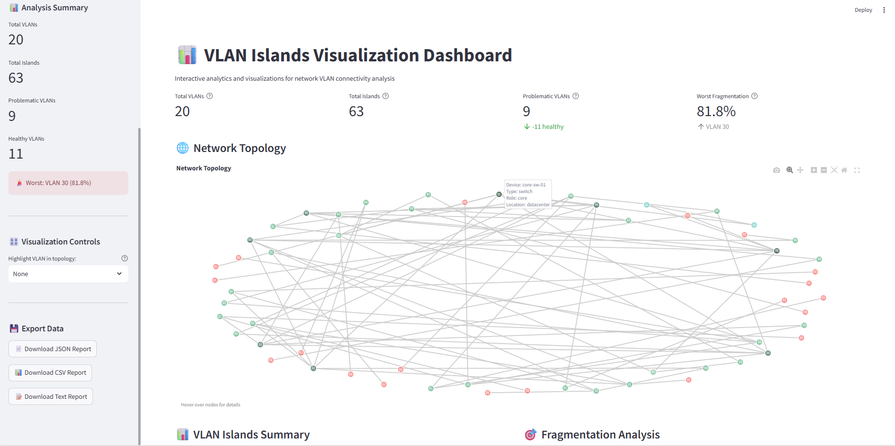

### Visualize All Health VLANs

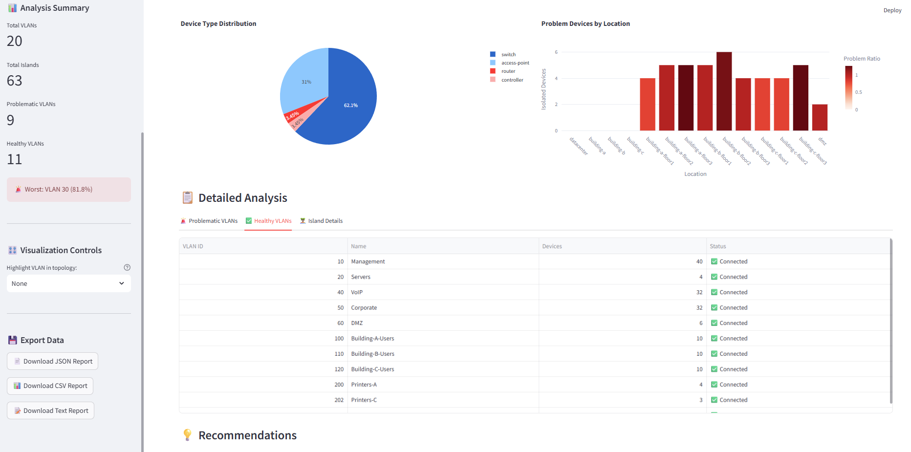

### Visualize Islands details Sheet

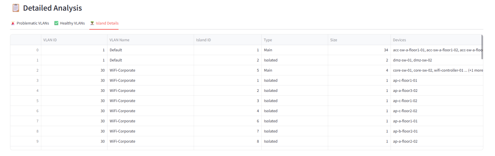

### Report Preview
> A sample CSV report is shown here. In the GUI, there are also options to download the report as **Text** or **JSON**.

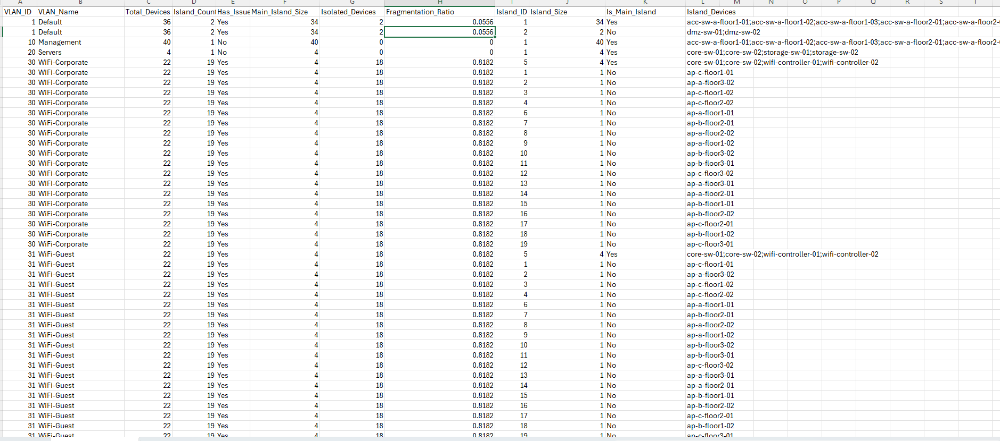

### Visualize Specific Network Topology

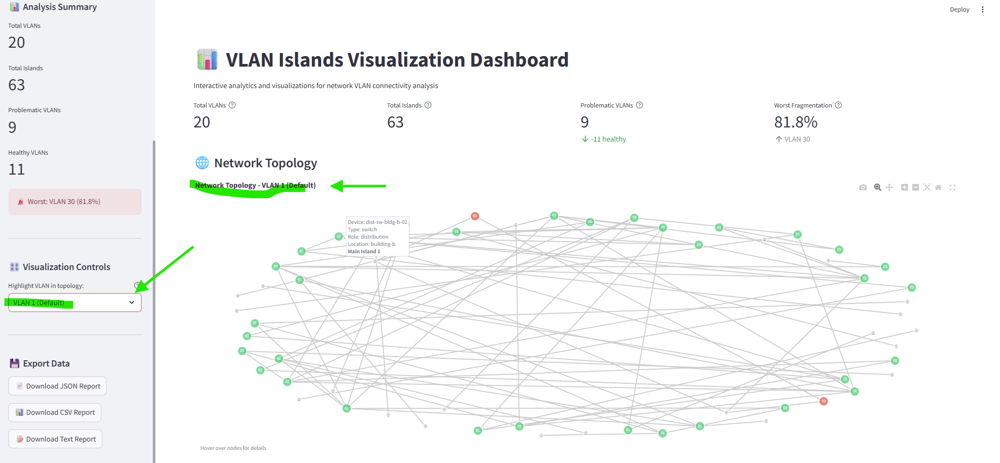

## B) Chatbot Glimpse

> ⚠️ Note: You need an **OpenAI API key**.  
> - Place it inside a `.env` file (or rename `.env.example` to `.env` and set the key with the flag `OPENAI_API_KEY`).  
> - Alternatively, you can enter the key directly in the frontend.  

### Bot Default Suggestions


### How the Bot Suggests Fixes

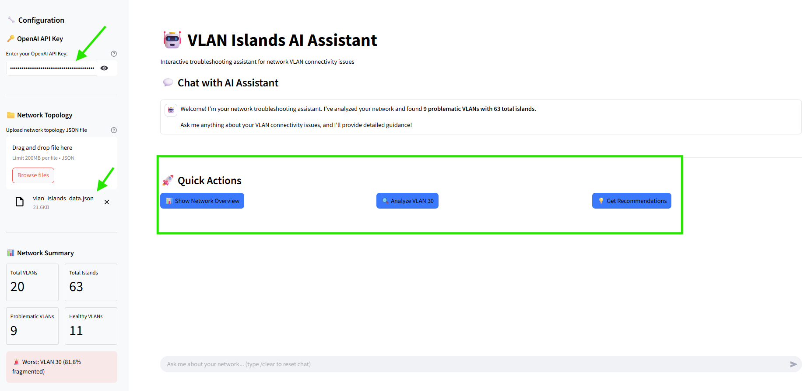

### Preserving Contextual Memory  

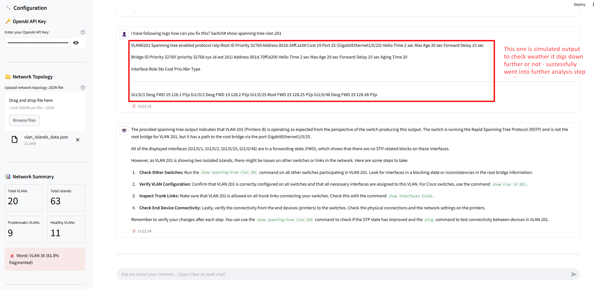


### Contexual memory can be exported:
Conversation history is visible here.  
`To scale up, session management could be improved by storing summarized assistant responses.`

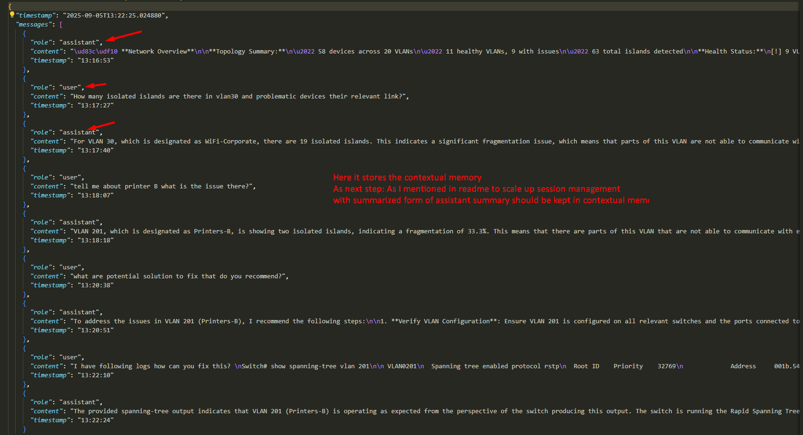


---

**Note:** Check the system prompt (`chatbot_config.yaml`). It is highly customizable by SMEs and can be adapted to handle multiple specialties.
